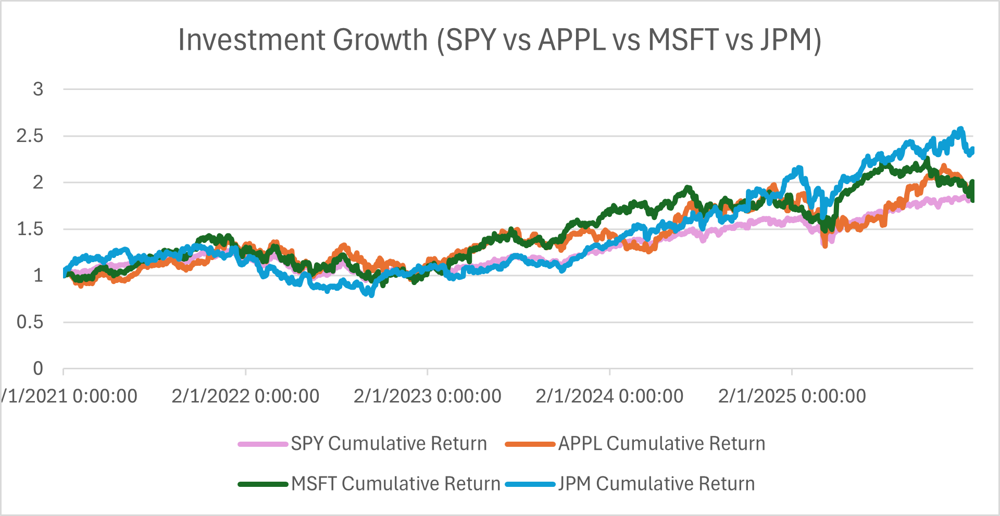

# Stock Portfolio Performance Analysis (Excel)

## Overview
This project analyzes 5 years of historical stock market data using Microsoft Excel.  
The goal was to learn core business analytics skills including data cleaning, return calculations, and financial visualization.

Stocks analyzed:
- SPY (S&P 500 ETF)
- AAPL (Apple)
- MSFT (Microsoft)
- JPM (JPMorgan Chase)

---

## Cumulative Return Comparison
The chart below shows the cumulative growth of each stock over the selected time period.

---

## Key Insights
- AAPL and MSFT significantly outperformed the broader market (SPY) over the 5-year period  
- SPY showed steadier growth with lower volatility compared to individual stocks  
- JPM generally followed market trends but achieved lower cumulative growth than major tech stocks  

---

## What I Did
- Collected and organized 5 years of daily stock price data  
- Calculated daily returns for each stock  
- Computed cumulative returns to measure long-term performance  
- Visualized stock performance using Excel line charts  

---

## Tools Used
- Microsoft Excel  
- GitHub  

---

## Files
📊 **Excel Workbook**  
[Download the full Excel analysis](Portfolio_Analysis.xlsx)

📈 **Chart**
- `cumulative_returns.png`

---

## Skills Demonstrated
- Financial data analysis  
- Excel formulas and functions  
- Data visualization  
- Analytical reasoning  

---

## Future Improvements
- Add volatility and risk metrics  
- Compare portfolio performance against SPY  
- Automate analysis using Python or SQL  
